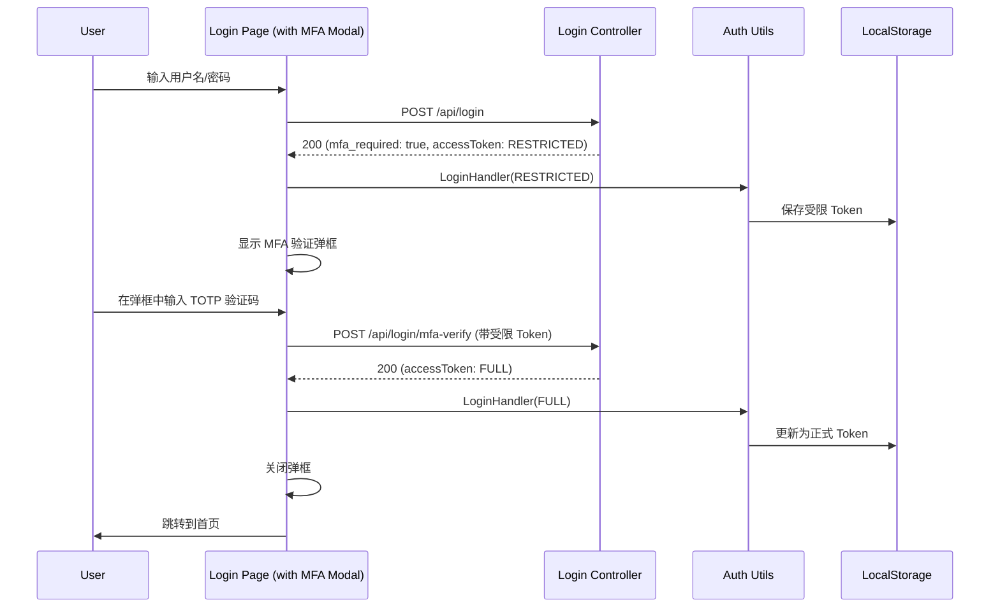

# MFA (多因素认证) 前端开发文档 (弹框版)

## 1. 项目背景

为了提高账户安全性，系统引入了自适应风险评估和 MFA (多因素认证) 机制。当后端检测到高风险登录时，会返回受限 Token 并要求用户进行二次验证（TOTP）。

## 2. 核心业务流程

### 2.1 登录流程与 MFA 弹框介入

用户在登录页提交后，若触发 MFA，页面将弹出验证窗口，而不是跳转。

### 2.2 全局拦截处理

若用户已登录但处于 `MFAPending` 状态访问业务接口，拦截器捕获 `403 MFA_REQUIRED` 后，应清空 Token 并引导回登录页，登录页会识别状态重新触发弹框。

## 3. 技术实施方案

### 3.1 数据模型 (Services & Models)

- **`src/services/demo/typings.d.ts`**:
  - 更新 `LoginResponse`：增加 `mfa_required?: boolean` 和 `required_types?: string[]`。
  - 新增 `MFAVerifyRequest` 类型：`{ code: string }`。
- **`src/services/demo/loginController.ts`**:
  - 新增 `verifyMFA(body: API.MFAVerifyRequest)` 方法，调用 `/api/login/mfa-verify`。

### 3.2 页面与组件开发

- **`src/pages/Login/index.tsx`**:
  - 引入 `MFAModal` 组件。
  - 增加 `isMFAModalVisible` 状态。
  - 处理登录响应：若 `mfa_required` 为 true，开启弹框。

### 3.3 拦截器 (Interceptor)

- **`src/models/request.ts`**:
  - 在 `errorHandler` 中捕获 `403` 且 `message === 'MFA_REQUIRED'`。
  - 强制用户重新登录以重新触发 MFA 流程。

## 4. 验收标准

1. [ ] 登录成功后若需要 MFA，页面应弹出验证框。
2. [ ] 在弹框中输入 TOTP 后，弹框关闭并成功跳转首页。
3. [ ] 取消弹框应留在登录页，且无法进入首页。
